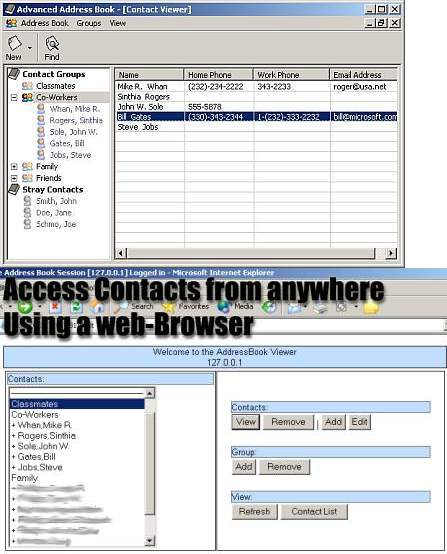



## Advanced Address Book

### Description

An addressbook that has features such as contact groups, online access, search, and much more. Uses Microsoft Access database to store data (included). References the DAO 3.6 library. Please send feedback.
 
### More Info
 

             |
---                |---
**Submitted On**   |2002-04-20 14:16:30
**By**             |[N/A](https://github.com/Planet-Source-Code/PSCIndex/blob/master/ByAuthor/empty.md)
**Level**          |Intermediate
**User Rating**    |4.6 (60 globes from 13 users)
**Compatibility**  |VB 5\.0, VB 6\.0
**Category**       |[Complete Applications](https://github.com/Planet-Source-Code/PSCIndex/blob/master/ByCategory/complete-applications__1-27.md)
**World**          |[Visual Basic](https://github.com/Planet-Source-Code/PSCIndex/blob/master/ByWorld/visual-basic.md)
**Archive File**   |[Advanced\_A1654161052003\.zip](https://github.com/Planet-Source-Code/advanced-address-book__1-49021/archive/master.zip)

